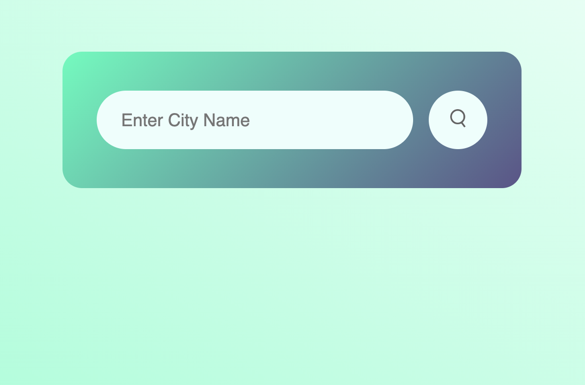
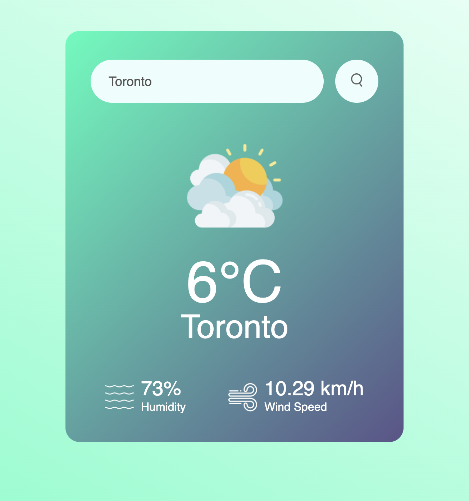
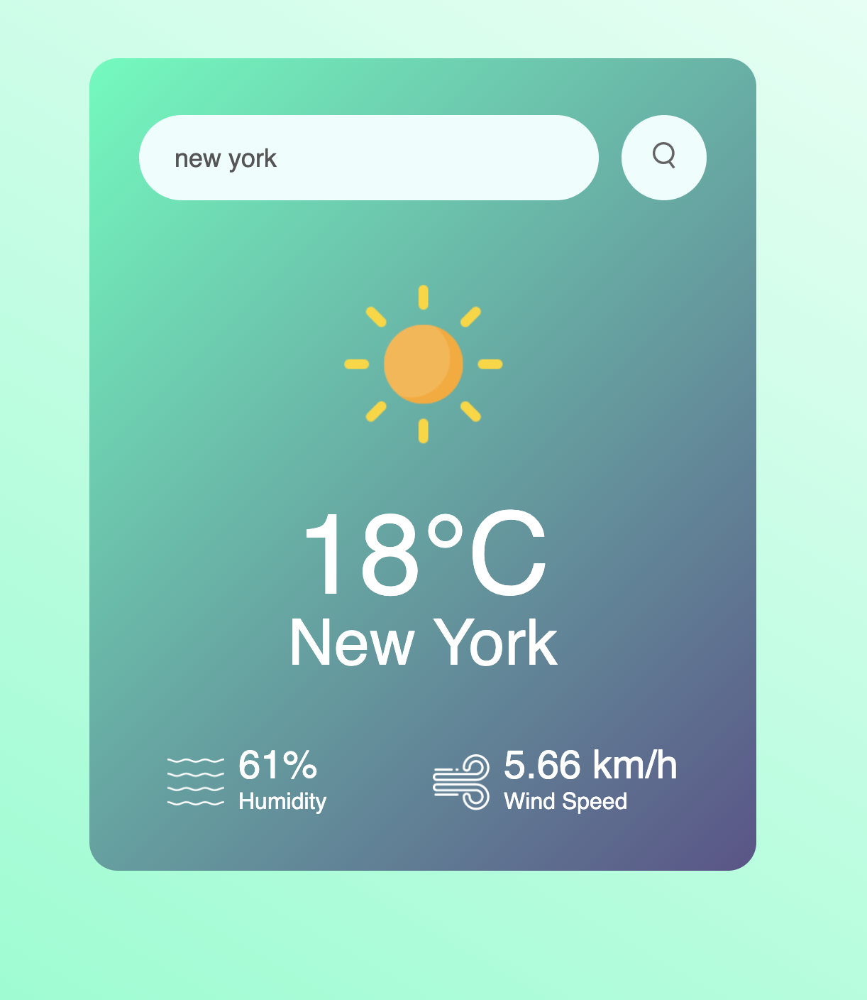
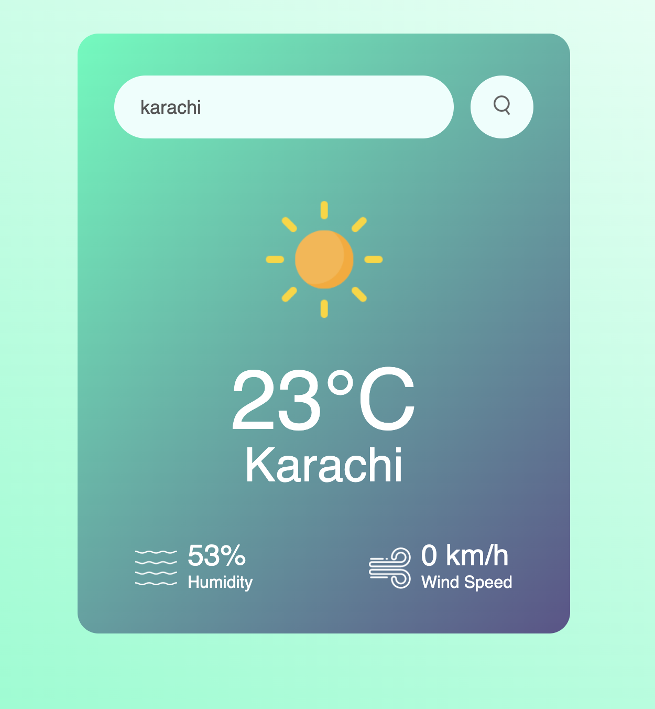

# Weather Report Web App

This is a simple web application that allows users to check the weather conditions for a specific city. The application uses HTML, CSS, and JavaScript, along with a weather API to fetch and display weather information.

Brace yourselves for a journey through my latest masterpiece - [**Live Demo**](https://dohad-weather-webapp.netlify.app/) 
## Features

- **Current Weather:** Enter the name of a city, and the application will display the current weather conditions.
- **Temperature:** The temperature is displayed in degrees Celsius.
- **Humidity:** The humidity level is shown.
- **Wind Speed:** The wind speed is provided.
- **Weather Description:** The application indicates whether it's rainy, cloudy, drizzling, sunny, etc.
- **Emoji Representation:** An emoji corresponding to the weather conditions is displayed for a more intuitive understanding.

## How to Use

1. Clone or download the repository to your local machine.
2. Open the `index.html` file in your web browser.
3. Enter the name of the city for which you want to check the weather.
4. Click the "Get Weather" button to display the weather information.

## Technologies Used

- HTML
- CSS
- JavaScript
- Weather API

---
## Screenshots

